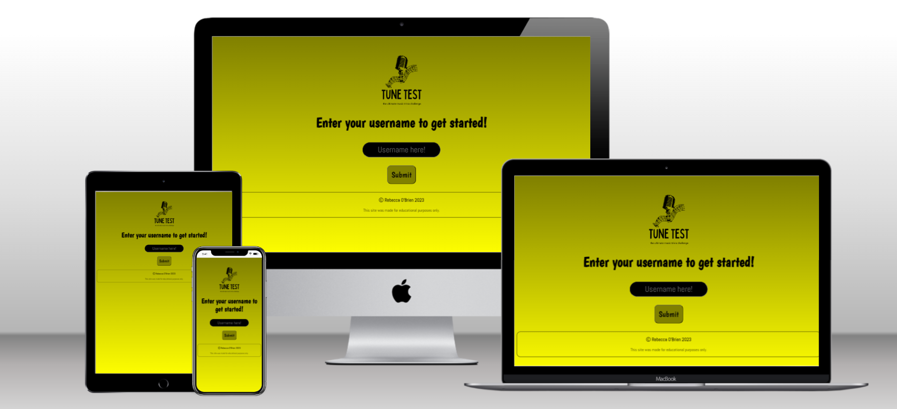
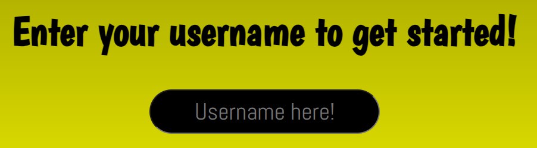
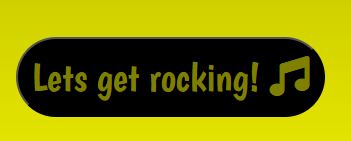
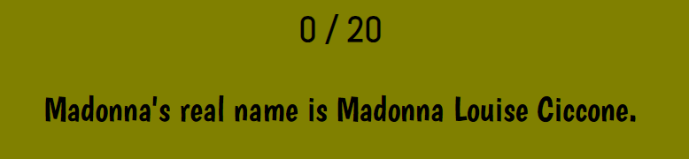
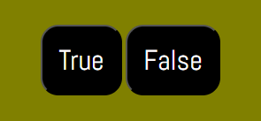
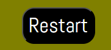
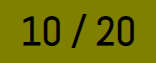
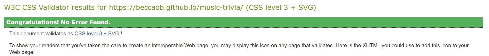

# Tune test - Musici Trivia Quiz
[View the live site here](https://beccaob.github.io/music-trivia/)

## Final Design 

## Introduction
My site is a music trivia quiz. The aim of this project was to create an interactive front-end site which responds to user actions. 

## User Expierence (UX)
- ### User Stories
1. As a user, I want to test my knowledge on music trivia.
- The user can test their knowledge by playing the quiz. 
2. As a user, I want to enter my unique username and have the game acknowledge it. 
- The user can enter their username by typing in the input-type(text) field. The game will welcome them and call them by their username. 
3. As a user, I want the screen to be responsive across all of my devices. 
- The game can be played across a reange of devices as it's fully responsive. 
4. As a user, I want to have answer options to choose from. 
- The game has two options - true & false. 
5. As a user, i want a wide array of questions to answer. 
- There are 20 questions to answer. 
6. As a user, I want to see my final score. 
- The users final score is displayed once all questions are answered. 
7. As a user, I want to be able to restart the quiz if needed. 
- There is a reset button which will reset the user score and randomly shuffle the questions again. 

- ### Design 
    - ### Colour Scheme 
    I used a olive to yellow gradient colour as I believe the colours go well together and do not cause any contrast errors. 
    1. Black was used for main text.  
    4. Black was used for hover background and olive was used for hover text, this allowed the user to confirm that they were hovering over the buttons. 
 

    - ### Fonts
    For the fonts, I used 'Boogaloo' for headings & 'Abel' for regular text, both from Google Fonts. I used 'sans-serif' as a backup should those fonts not be available for all.

    - ### Icons 
    The icon used in the start button was obtained from Font Awesome. 

    - ### Images
    The logo image was made on Canva Pro by myself - image source in reference section. 

### Wireframes
I used wireframes to give myself a general idea of what I wanted the site to look like.

[home-page](assets/images/readme-img/home-page-wf.png)
[gamearea](assets/images/readme-img/game-wf.png)

## Features

- ### Logo Image

 Contains title & description of the game.

 !logo](assets/images/readme-img/logo.png)

- ### Username Input

 Allows user to enter their name. If a name is not entered - an error alert will display asking the user to choose a name before continuing. Once the name has been selected - the user is welcomed by their name and asked if they would like to begin the game.

 

- ### Start Button

Allows user to start the game. This button loads the game.js file. Functions are explained in the fuctions section below. The button text italicises when the user hovers over it so they know its a clickable button.

 

- ### Question Text

 This area displays the game questions which are captured from the game.js file.

 

- ### True & False Buttons

Allows user to choose their answer. The button changes colour when the user hovers over it so they know its a clickable button.

 

- ### Restart

 This button will allow the user to restart the game at any time. The background colour and text colour will change if this button is hovered over so the user knows they can click it.

 

- ### User Score

 The user score is displayed over the question text. Once all questions are answered - the score is also displayed along with a message depending on the score gained.

 

## Technologies used
 ### Languages
 1. HTML
 2. CSS
 3. JavaScript
   

### Programs

1. Balsamiq
Balsamiq was used to create my wireframes.
2. Git
Used for version control, commits and pushing to Github.
3. Github
Used for storing my repository, files and images pushed from gitpod.
4. Code Anywhere
IDE used.
5. Chrome Developer Tools
Used for troubleshooting when needed. Also used to check responsiveness.
6. Google Fonts
Used for site fonts.
7. Font Awesome
used for icons.
8. Canva Pro
Used to create the logo image.
9. Favicon.io
Favicon files were created using <https://favicon.io>

## Testing

The W3C Markup Validator, W3C CSS Validator Services and jshint.com were used to validate my project.

JS Hint
