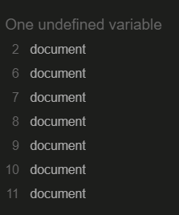

# Tune test - Musici Trivia Quiz
[View the live site here](https://beccaob.github.io/music-trivia/)

## Final Design 

## Introduction
My site is a music trivia quiz. The aim of this project was to create an interactive front-end site which responds to user actions. 

## User Expierence (UX)
### User Stories
1. As a user, I want to test my knowledge on music trivia.
  The user can test their knowledge by playing the quiz. 
2. As a user, I want to enter my unique username and have the game acknowledge it. 
 The user can enter their username by typing in the input-type(text) field. The game will welcome them and call them by their username. 
3. As a user, I want the screen to be responsive across all of my devices. 
 The game can be played across a reange of devices as it's fully responsive. 
4. As a user, I want to have answer options to choose from. 
 The game has two options - true & false. 
5. As a user, i want a wide array of questions to answer. 
 There are 20 questions to answer. 
6. As a user, I want to see my final score. 
 The users final score is displayed once all questions are answered. 
7. As a user, I want to be able to restart the quiz if needed. 
 There is a reset button which will reset the user score and randomly shuffle the questions again. 

- ### Design 
    - ### Colour Scheme 
    I used a olive to yellow gradient colour as I believe the colours go well together and do not cause any contrast errors. 
    1. Black was used for main text.  
    4. Black was used for hover background and olive was used for hover text, this allowed the user to confirm that they were hovering over the buttons. 
    5. 
    - ### Fonts
    For the fonts, I used 'Boogaloo' for headings & 'Abel' for regular text, both from Google Fonts. I used 'sans-serif' as a backup should those fonts not be available for all.

    - ### Icons 
    The icon used in the start button was obtained from Font Awesome. 

    - ### Images
    The logo image was designed using Canva Pro - image source in reference section. 

### Wireframes
I used wireframes to give myself a general idea of what I wanted the site to look like.

## Features

- ### Logo Image

 Contains title & description of the game. This image also acts as a link to the home page.

 

- ### Username Input

 Allows user to enter their name. If a name is not entered - an error alert will display asking the user to choose a name before continuing. Once the name has been selected - the user is welcomed by their name and asked if they would like to begin the game.

 

- ### Start Button

Allows user to start the game. This button loads the game.js file. Functions are explained in the fuctions section below. The button text italicises when the user hovers over it so they know its a clickable button.

 

- ### Question Text

 This area displays the game questions which are captured from the game.js file. 

 

- ### True & False Buttons

Allows user to choose their answer. The button changes colour when the user hovers over it so they know its a clickable button.

 

- ### Restart

 This button will allow the user to restart the game at any time. The background colour and text colour will change if this button is hovered over so the user knows they can click it.

 

- ### User Score

 The user score is displayed over the question text. Once all questions are answered - the score is also displayed along with a message depending on the score gained.

 

 - ### Correct/Incorrect Message

Each time a question is answered - the game will tell the user if they have selected the correct answer or not. 

I used setTimeout on the currentQuestions function to allow time for this to display before the next question is shown. This elimates the need for the user to click into the next question and makes the game run smoother. The idea for setTimeout was obtained from the following website: [setTimeout Credit](https://www.tutorialspoint.com/How-to-delay-a-JavaScript-function-call-using-JavaScript#:~:text=Whenever%20we%20want%20to%20call,delay%20before%20executing%20a%20function.)

## Technologies used
 ### Languages
 1. HTML
 2. CSS
 3. JavaScript
   

### Programs

1. Balsamiq
Balsamiq was used to create my wireframes.
2. Git
Used for version control, commits and pushing to Github.
3. Github
Used for storing my repository, files and images pushed from gitpod.
4. Code Anywhere
IDE used.
5. Chrome Developer Tools
Used for troubleshooting when needed. Also used to check responsiveness.
6. Google Fonts
Used for site fonts.
7. Font Awesome
used for icons.
8. Canva Pro
Used to create the logo image.
9. Favicon.io
Favicon files were created using <https://favicon.io>

## Testing

The W3C Markup Validator, W3C CSS Validator Services and jshint.com were used to validate my project.

### HTML Testing: 

My game contains two .html files. I used WC3 Markup Validator to check each page. Please see results below:

#### index.html Testing

I ran into one error when testing index.html. Please see screenshot below:

This was corrected by just using the anchor tag and styling same. When i ran the validator again, it passed with no issues.

#### game.html Testing

I ran into one error when testing game.html. Please see screenshot below:

I fixed this by moving the footer inside the body tags. 

## CSS Testing

No errors were found when testing my .css file. 

### Js Hint

1. script.js 
   No errors encountered. One undefined document - this is referencing the dom. 

1. game.js
    Encountered six errors on inital test. See screenshot below: 

    This was fixed by removing all unnessery semi-colons. One undefined document - this is referencing the dom.

    

### Lighthouse 

Lighthouse Timespan Testing:

Lighthouse Navigation Testing:

### WAVE Testing

There are two errors present. 

1. No form label. When I enclosed the username feature in the form element, my quiz was not functioning as desired. I did not have time to fix this issue but I am aware of it and aim to fix it in the future. 
2. Empty button - this is my submit button. I am unsure of how to fix this issue but I will investigate further in the future. 

### Devices

All pages were tested to ensure responsiveness on screen sizes from 320px upwards. Each page was tested on Chrome, Edge, Safari and Firefox.

Steps to test:

1. Open the browser and navigate to [Tune Test](https://beccaob.github.io/music-trivia/index.html)
2. Open the developer tools ( right click & inspect )
3. Set to responsive & decrease width to 320px
4. Set the zoom to 50%
5. Click & drag window to max width

Expected Outcome:
- Responsive on all screen sizes, no pixelated/stretched images
- No horizontal scroll bar
- No element overflow

Actual Outcome:

The website behaved as expected across all tests.

The site was also tested on the following devices and no issues were detected:

- Apple IPhone 13
- Asus 15.6" M509DA-EJ034T
- HP Pro Desk 400 G6 SFF

## Manual Testing

- Browser Compatibility

Browser | Outcome | Pass/Fail  
--- | --- | ---
Google Chrome | No appearance, responsiveness nor functionality issues.| Pass
Safari | No appearance, responsiveness nor functionality issues. | Pass
Mozilla Firefox | No Appearance, No responsiveness nor functionality issues.| Pass
Microsoft Edge | No appearance, responsiveness nor functionality issues. | Pass

- Device compatibility

Device | Outcome | Pass/Fail
--- | --- | ---
Iphone13 | No appearance, responsiveness nor functionality issues. | Pass
Asus 15.6" M509DA-EJ034T | No appearance, responsiveness nor functionality issues. | Pass
HP Pro Desk 400 G6 SFF | No appearance, responsiveness nor functionality issues. | Pass

- Common Elements Testing

  - index.html

    Feature | Outcome | Pass/Fail
    --- | --- | ---
    Logo Image | Link are working as expected. | Pass
    Username | User can enter username, alert shows if user tries to start the game without one | Pass
    Submit Button | Shows username and welcome message when clicked | Pass
    Start Button | Takes user to game.js | Pass

  - game.js

    Feature | Outcome | Pass/Fail
    --- | --- | ---
    Questions | Display once game is loaded | Pass
    True/False Buttons | Change colour when hovering over, correct answer displayed once clicked and vice versa | Pass
    Correct/Incorrect Message | Displayed when correct/incorrect answer is chosen & next question loads automatically | Pass
    User Score | Increases when correct answer is chosen | Pass
    End Of Quiz Message | Displays when all questions are answered & displays user score with relevant message | Pass
    Restart Button | Restarts the game | Pass

### Unfixed Bugs 
As far as I am aware - there are no unfixed bugs in my project. My only issue is with WAVE testing which is mentioned above. 

# **Deployment**

The website was created using CodeAnywhere and pushed to the github remote repository 'music-trivia'
The following git commands were used throughout development to push code to the remote repository:

- git add .
  - This command was used to add a change in the working directory to the staging area.

- git commit -m "commit message"
  - This command was used to commit changes to the local repo queue ready to be pushed to the remote repo.

- git push
  - This command was used to push all committed code to the remote repo on github.

### Deployment to Github Pages

The site was deployed to Github Pages. Steps used are as follows:

1. In the repo, open the settings tab
2. In left menu, click 'Pages'
3. From the source section, select 'Branch:main' from the dropdown menu
4. Click 'Save'
5. A live link will be displayed in green banner when published successfully

### Clone Repo Code Locally

Navigate to the github repo you want to clone for local use

1. Click the 'Code' drop down menu
2. Click on 'HTTPS'
3. Copy the repo link to the keyboard
4. Open preferred integrated development environment (IDE)

(Git must be installed for the final step)

5. Type git clone copied-git-url into the IDE terminal

The project will now be cloned on your local machine.

### Forking the repository

1. Log into the Github repository.
2. Underneath your avatar is a button labelled **Fork**, click this.
3. You should have your own copy now.

### Features To Implement 
1. Levels - easy, medium & hard levels.to test the user. 
2. Leadboard - Leaderboard using google docs. 

### Acknowledgements

1. Slack Community for continued support.
2. Victor from Stryker programming team for their tips, tricks and support throughout this project.
3. My family & Partner for their patience, support and understanding.
4. Myself for perserviering through several function errors and changes, long days, nights and several instances of imposter syndrome.

### Credits 

1. Code Institute course material
2. JS Cheatsheet [js cheatsheet](https://htmlcheatsheet.com/js/)
3. Canva Pro for Logo Image 
    "Mic 3" - Ummi Kalum
4. [setTimeout Credit](https://www.tutorialspoint.com/How-to-delay-a-JavaScript-function-call-using-JavaScript#:~:text=Whenever%20we%20want%20to%20call,delay%20before%20executing%20a%20function.)
